# Exam template for 02476 Machine Learning Operations

This is the report template for the exam. Please only remove the text formatted as with three dashes in front and behind
like:

```--- question 1 fill here ---```

Where you instead should add your answers. Any other changes may have unwanted consequences when your report is
auto-generated at the end of the course. For questions where you are asked to include images, start by adding the image
to the `figures` subfolder (please only use `.png`, `.jpg` or `.jpeg`) and then add the following code in your answer:

``

In addition to this markdown file, we also provide the `report.py` script that provides two utility functions:

Running:

```bash
python report.py html
```

Will generate a `.html` page of your report. After the deadline for answering this template, we will auto-scrape
everything in this `reports` folder and then use this utility to generate a `.html` page that will be your serve
as your final hand-in.

Running

```bash
python report.py check
```

Will check your answers in this template against the constraints listed for each question e.g. is your answer too
short, too long, or have you included an image when asked. For both functions to work you mustn't rename anything.
The script has two dependencies that can be installed with

```bash
pip install typer markdown
```

or

```bash
uv add typer markdown
```

## Overall project checklist

The checklist is *exhaustive* which means that it includes everything that you could do on the project included in the
curriculum in this course. Therefore, we do not expect at all that you have checked all boxes at the end of the project.
The parenthesis at the end indicates what module the bullet point is related to. Please be honest in your answers, we
will check the repositories and the code to verify your answers.

### Week 1

* [*] Create a git repository (M5)
* [*] Make sure that all team members have write access to the GitHub repository (M5)
* [*] Create a dedicated environment for you project to keep track of your packages (M2)
* [*] Create the initial file structure using cookiecutter with an appropriate template (M6)
* [*] Fill out the `data.py` file such that it downloads whatever data you need and preprocesses it (if necessary) (M6)
* [*] Add a model to `model.py` and a training procedure to `train.py` and get that running (M6)
* [*] Remember to either fill out the `requirements.txt`/`requirements_dev.txt` files or keeping your
    `pyproject.toml`/`uv.lock` up-to-date with whatever dependencies that you are using (M2+M6)
* [*] Remember to comply with good coding practices (`pep8`) while doing the project (M7)
* [ ] Do a bit of code typing and remember to document essential parts of your code (M7)
* [*] Setup version control for your data or part of your data (M8)
* [*] Add command line interfaces and project commands to your code where it makes sense (M9)
* [*] Construct one or multiple docker files for your code (M10)
* [ ] Build the docker files locally and make sure they work as intended (M10)
* [*] Write one or multiple configurations files for your experiments (M11)
* [*] Used Hydra to load the configurations and manage your hyperparameters (M11)
* [*] Use profiling to optimize your code (M12)
* [*] Use logging to log important events in your code (M14)
* [*] Use Weights & Biases to log training progress and other important metrics/artifacts in your code (M14)
* [*] Consider running a hyperparameter optimization sweep (M14)
* [*] Use PyTorch-lightning (if applicable) to reduce the amount of boilerplate in your code (M15)

### Week 2

* [*] Write unit tests related to the data part of your code (M16)
* [*] Write unit tests related to model construction and or model training (M16)
* [*] Calculate the code coverage (M16)
* [*] Get some continuous integration running on the GitHub repository (M17)
* [*] Add caching and multi-os/python/pytorch testing to your continuous integration (M17)
* [*] Add a linting step to your continuous integration (M17)
* [ ] Add pre-commit hooks to your version control setup (M18)
* [ ] Add a continues workflow that triggers when data changes (M19)
* [ ] Add a continues workflow that triggers when changes to the model registry is made (M19)
* [*] Create a data storage in GCP Bucket for your data and link this with your data version control setup (M21)
* [*] Create a trigger workflow for automatically building your docker images (M21)
* [ ] Get your model training in GCP using either the Engine or Vertex AI (M21)
* [*] Create a FastAPI application that can do inference using your model (M22)
* [ ] Deploy your model in GCP using either Functions or Run as the backend (M23)
* [*] Write API tests for your application and setup continues integration for these (M24)
* [*] Load test your application (M24)
* [ ] Create a more specialized ML-deployment API using either ONNX or BentoML, or both (M25)
* [*] Create a frontend for your API (M26)

### Week 3

* [ ] Check how robust your model is towards data drifting (M27)
* [*] Setup collection of input-output data from your deployed application (M27)
* [ ] Deploy to the cloud a drift detection API (M27)
* [ ] Instrument your API with a couple of system metrics (M28)
* [ ] Setup cloud monitoring of your instrumented application (M28)
* [ ] Create one or more alert systems in GCP to alert you if your app is not behaving correctly (M28)
* [ ] If applicable, optimize the performance of your data loading using distributed data loading (M29)
* [ ] If applicable, optimize the performance of your training pipeline by using distributed training (M30)
* [*] Play around with quantization, compilation and pruning for you trained models to increase inference speed (M31)

### Extra

* [ ] Write some documentation for your application (M32)
* [ ] Publish the documentation to GitHub Pages (M32)
* [ ] Revisit your initial project description. Did the project turn out as you wanted?
* [ ] Create an architectural diagram over your MLOps pipeline
* [*] Make sure all group members have an understanding about all parts of the project
* [*] Uploaded all your code to GitHub

## Group information

### Question 1
> **Enter the group number you signed up on <learn.inside.dtu.dk>**
>
> Answer: 
>
Group 37

### Question 2
> **Enter the study number for each member in the group**
>Example: sXXXXXX, sXXXXXX, sXXXXXX

> Answer:

    s243927, s250273, s250202, s254631, s250829

### Question 3
> **Did you end up using any open-source frameworks/packages not covered in the course during your project? If so**
> **which did you use and how did they help you complete the project?**
>
> Recommended answer length: 0-200 words.
>
> Example:
> *We used the third-party framework ... in our project. We used functionality ... and functionality ... from the*
> *package to do ... and ... in our project*.
>
> Answer:

Yes, we used several open-source tools that were not directly covered in the course.
We mainly used the Hugging Face Transformers library, which made it easy to load and fine-tune pretrained transformer models such as T5. This allowed us to focus on adapting existing models to the translation task instead of implementing them from scratch.
We also used the Hugging Face Datasets package to load and preprocess the OpenSubtitles dataset from OPUS. It simplified handling large amounts of parallel text data.

## Coding environment

> In the following section we are interested in learning more about you local development environment. This includes
> how you managed dependencies, the structure of your code and how you managed code quality.

### Question 4

> **Explain how you managed dependencies in your project? Explain the process a new team member would have to go**
> **through to get an exact copy of your environment.**
>
> Recommended answer length: 100-200 words
> Example: We used ... for managing our dependencies. The list of dependencies was auto-generated using ... . To get a complete copy of our development environment, one would have to run the following commands

Answer:

We managed dependencies using Python’s pyproject.toml, together with a lock file (uv.lock). All required packages and their versions are defined in these files, which ensures that everyone in the group uses the same dependencies.

To allow reproducibility, we used uv as the package and environment manager. The lock file guarantees that the exact same versions of all dependencies are installed on different machines.

For a new team member to get an exact copy of the development environment, the process would be:
1. Clone the project repository.
2. Install uv.
3. Navigate to the project root directory.
4. Run: (uv sync) to install all dependencies using the lock file.
5. Run the project using: (uv run main.py).

Following these steps ensures that a new team member can reproduce the same environment and run the code without additional configuration.

### Question 5

> **We expect that you initialized your project using the cookiecutter template. Explain the overall structure of your**
> **code. What did you fill out? Did you deviate from the template in some way?**
>
> Recommended answer length: 100-200 words
> Example: From the cookiecutter template we have filled out the ... , ... and ... folder. We have removed the ... folder because we did not use any ... in our project. We have added an ... folder that contains ... for running our experiments.
> Answer:

We initialized our project using the course-provided cookiecutter template, which gave us a standardized and organized project structure.

When setting up the project, we filled out the cookiecutter prompts such as the project name, package name, and basic metadata. Most default settings provided by the template were kept, as they already matched the needs of our project.

The main project code follows the structure defined by the template. The core Python package is located under src/en_es_translation, which contains separate modules for data handling, model definition, training, evaluation, prediction, and visualization. This separation helped keep responsibilities clear and made the code easier to maintain. The template’s suggested folders for data, models, configs, notebooks, reports, and tests were also used, which supported a clean workflow from data preprocessing to evaluation and reporting.

We made a small deviation from the template by adding a  main.py file. This file serves as a simple entry point to run the project using uv run main.py, while the main logic remains inside the structured package under src/. Apart from this, the overall structure follows the original cookiecutter template, and no major components were removed.

### Question 6

> **Did you implement any rules for code quality and format? What about typing and documentation? Additionally,**
> **explain with your own words why these concepts matters in larger projects.**
>
> Recommended answer length: 100-200 words.
> Example: We used ... for linting and ... for formatting. We also used ... for typing and ... for documentation. These concepts are important in larger projects because ... . For example, typing ..
> Answer:

Yes, we implemented rules for code quality and formatting in the project.
We used Ruff to automatically check the code for style issues and common mistakes, and to fix them when possible. This helped keep the code clean and consistent across the whole project.

We also used type hints in important parts of the code so it is clear what kind of data functions expect and return. This makes the code easier to understand and helps catch errors early.

For documentation, we used README files and docstrings. The README files explain the overall project structure and how to run the code, while docstrings are used in important parts of the code, such as the data loading and model logic, to describe what the functions and classes do.

In larger projects, code quality and documentation are important because many people may work on the same code over time. Clear code and good documentation make it easier for others to understand, use, and change the code, and help reduce mistakes and confusion.
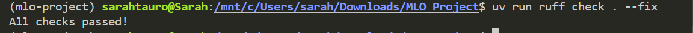
## Version control

> In the following section we are interested in how version control was used in your project during development to
> corporate and increase the quality of your code.

### Question 7

> **How many tests did you implement and what are they testing in your code?**
>
> Recommended answer length: 50-100 words.
> Example: In total we have implemented X tests. Primarily we are testing ... and ... as these the most critical parts of our application but also ... .
> Answer:

In total, we implemented 7 tests, covering both the data pipeline and the model set up. For the data part, the tests checked that the custom dataset behaves as expected and that the preprocessing step correctly creates the train, validation and test splits. For the model, the tests focus on the most critical functionality, which includes:
- validating hyperparameters during initialization
- ensuring the forward pass returns a list of translated strings
- verifying that the training step produces a valid loss
- confirming that the optimizer is correctly configured

### Question 8

> **What is the total code coverage (in percentage) of your code? If your code had a code coverage of 100% (or close**
> **to), would you still trust it to be error free? Explain you reasoning.**
>
> Recommended answer length: 100-200 words.
>
> Example:
> The total code coverage of code is X%, which includes all our source code. We are far from 100% coverage of our **
> *code and even if we were then...*
>
> Answer:


The total code coverage of our project is 44%, as measured using pytest with the pytest-cov plugin. This coverage mainly comes from unit tests targeting the data processing pipeline (data.py) and the model construction and training logic (model.py), while other components such as training scripts, prediction logic, and evaluation utilities currently have little or no test coverage. At this stage of the project, this level of coverage is acceptable because it focuses on the most critical parts of the system, where errors are most likely to have severe consequences.

Even if our code coverage were 100% or close to it, we would not fully trust the code to be error free. Code coverage only indicates which lines of code are executed during tests, not whether the tests thoroughly verify correctness or cover meaningful edge cases. In machine learning systems, many failures arise from data-related issues, numerical instability, or distribution shifts, which unit tests and high coverage alone cannot capture. Therefore, code coverage should be seen as a useful diagnostic tool, but it must be complemented by well-designed tests, integration testing, and empirical evaluation of model behavior.

### Question 9

> **Did you workflow include using branches and pull requests? If yes, explain how. If not, explain how branches and**
> **pull request can help improve version control.**
>
> Recommended answer length: 100-200 words.
>
> Example:
> *We made use of both branches and PRs in our project. In our group, each member had an branch that they worked on in*
> *addition to the main branch. To merge code we ...*
>
> Answer:

Our workflow made extensive use of branches, allowing team members to work on different features or experiments in parallel without directly affecting the main branch. Each contributor typically developed their changes on a separate branch and ensured that their work was stable before integrating it into the main codebase. This helped reduce conflicts and made it easier to manage and test incremental changes. Naturally, some conflicts arised and we had to communicate to solve them.

However, we did not rely heavily on formal pull requests. Since the team was in constant communication throughout the project, most merges were coordinated directly among team members. This allowed us to resolve potential conflicts quickly and ensured that everyone was aware of ongoing changes. 

We believe the combination of frequent branching and continuous communication enabled efficient collaboration while still maintaining control over the project’s evolution.

### Question 10

> **Did you use DVC for managing data in your project? If yes, then how did it improve your project to have version**
> **control of your data. If no, explain a case where it would be beneficial to have version control of your data.**
>
> Recommended answer length: 100-200 words.
>
> Example:
> *We did make use of DVC in the following way: ... . In the end it helped us in ... for controlling ... part of our*
> *pipeline*
>
> Answer:

Yes, we utilized DVC to manage our project's datasets. We configured DVC to track our large data files and stored the actual content in remote storage, committing only the lightweight .dvc  files to GitHub. It kept our Git repository light and clean, preventing the bloat and errors. Additionally, having it in the DVC ensures full experiment reproducibility. By linking specific data versions to Git commits, we can travel back in time to any previous model version and immediately retrieve the exact data used for that specific training run. This eliminates ambiguity and allows the team to collaborate without manually transferring large dataset files.

### Question 11

> **Discuss you continuous integration setup. What kind of continuous integration are you running (unittesting,**
> **linting, etc.)? Do you test multiple operating systems, Python  version etc. Do you make use of caching? Feel free**
> **to insert a link to one of your GitHub actions workflow.**
>
> Recommended answer length: 200-300 words.
>
> Example:
> *We have organized our continuous integration into 3 separate files: one for doing ..., one for running ... testing*
> *and one for running ... . In particular for our ..., we used ... .An example of a triggered workflow can be seen*
> *here: <weblink>*
>
> Answer:

We implemented GitHub Actions as our continuous integration platform, with workflows automatically triggered on every push to the main branch and any feature/** branches. Our CI pipeline was designed to maintain code quality and ensure functionality across different environments.
For environment management, we leveraged uv, which provided fast and reliable dependency resolution and setup. This choice significantly reduced our setup time compared to traditional pip-based installations. Code quality enforcement was handled by Ruff, a modern Python linter that performs near-instantaneous static analysis. Ruff's speed allowed us to catch style violations, potential bugs, and code smells without adding noticeable overhead to our CI runtime.
Testing was conducted using pytest combined with coverage for comprehensive code coverage monitoring. This combination allowed us to track which parts of our codebase were exercised by our test suite and identify areas needing additional testing. We executed our test suite on every commit to catch regressions early in the development process.
Cross-platform compatibility was a priority, so we tested against all three major operating systems: Ubuntu, Windows, and macOS. All platforms used Python 3.13 to ensure consistency. This multi-platform testing approach helped us identify platform-specific issues before they reached production.
To optimize build times, we implemented caching in our pipeline using the enable-cache: true configuration. This prevented redundant downloads of dependencies on subsequent runs, dramatically reducing our CI execution time. The cached dependencies persisted between runs as long as our requirements remained unchanged.
You can view our complete CI configuration in our repository at .github/workflows/ci.yml, which documents the full implementation of these practices.

## Running code and tracking experiments

> In the following section we are interested in learning more about the experimental setup for running your code and
> especially the reproducibility of your experiments.

### Question 12

> **How did you configure experiments? Did you make use of config files? Explain with coding examples of how you would**
> **run a experiment.**
>
> Recommended answer length: 50-100 words.
>
> Example:
> *We used a simple argparser, that worked in the following way: Python  my_script.py --lr 1e-3 --batch_size 25*
>
> Answer:

We configured our experiments using .yaml configuration files. We separated settings both for the data processing and training step. This allowed us to define key hyperparameters such as learning rate, batch size or number of epochs, as well as dataset-related parameters without changing the code itself. The code also established default hyperparameters. We used Hydra to load and manage these configurations, which made it easy to run different experiments or modify specific parameters through command-line overrides.
For example, an experiment for the data processing can be run as:

--> uv run en_es_translation/src/en_es_translation/data.py data=data_2

### Question 13

> **Reproducibility of experiments are important. Related to the last question, how did you secure that no information**
> **is lost when running experiments and that your experiments are reproducible?**
>
> Recommended answer length: 100-200 words.
>
> Example:
> *We made use of config files. Whenever an experiment is run the following happens: ... . To reproduce an experiment*
> *one would have to do ...*
>
> Answer:

To ensure reproducibility, we relied on configuration files we mentioned earlier to capture all relevant information for each experiment. Both data preprocessing parameters and training hyperparameters were stored in .yaml files that were version controlled, ensuring that experiment settings were explicit. Hydra handles the configuration composition at runtime, which helps prevent inconsistencies between runs.

We also used logging throughout the data processing and training steps to record important execution details. When enabled, Weights & Biases was used to log configurations, metrics and checkpoints. This made tracking and comparing experiments easier, as well as providing a clearer visualization of different hyperparameter combinations. Weights & Biases will be discussed in the following question. To reproduce a specific experiment, one only needs to rerun the code using the same configuration files or command-line overrides.

### Question 14

> **Upload 1 to 3 screenshots that show the experiments that you have done in W&B (or another experiment tracking**
> **service of your choice). This may include loss graphs, logged images, hyperparameter sweeps etc. You can take**
> **inspiration from [this figure](figures/wandb.png). Explain what metrics you are tracking and why they are**
> **important.**
>
> Recommended answer length: 200-300 words + 1 to 3 screenshots.
>
> Example:
> *As seen in the first image when have tracked ... and ... which both inform us about ... in our experiments.*
> *As seen in the second image we are also tracking ... and ...*
>
> Answer:

Due to computational access limitations, we limited our experiments to 4 sweep runs and the number of hyperparameters explored to keep training feasible. We initially attempted to use the DTU's hpc, but encountered setup difficulties as well as availability issues, since the system's resources were often occupied. As a result, we focused on a small set of hyperparameters that still allowed us to analyze training behavior and model performance.

The images illustrate how we used Weights & Biases to track and compare these experiments. Across all runs, the core metrics logged were training loss, validation loss and key hyperparameters such as learning rate and batch size. The first image shows training loss over steps for each run. These curves help diagnose convergence behavior and stability, as well as allowing direct comparison of how different hyperparameter choices affect learning dynamics. The second one compares the final validation loss across runs with a bar chart, making it easy to rank experiments and select the best configuration. Finally, the third visualization shows the sweep over learning rate and batch size, with validation loss used as the target metric. This representation is useful for identifying interactions between hyperparameters. In this experiment, we can observe that the training with batch size 16 and learning rate 0.001 obtains the lowest validation loss.

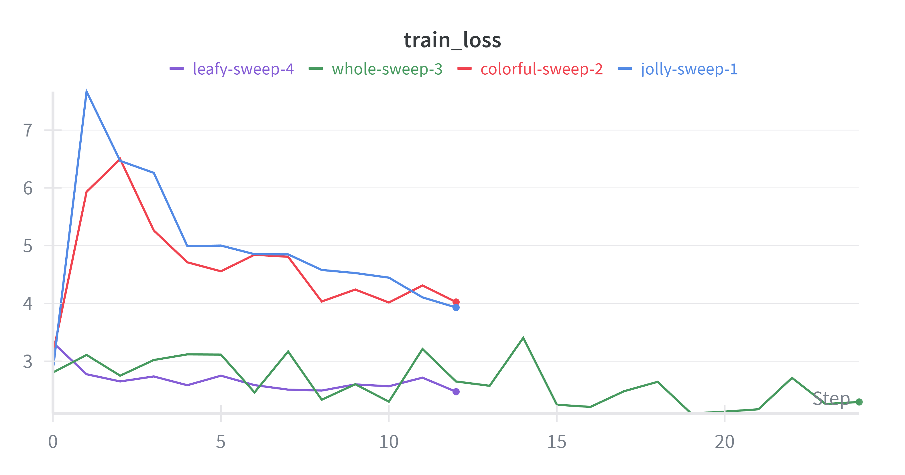
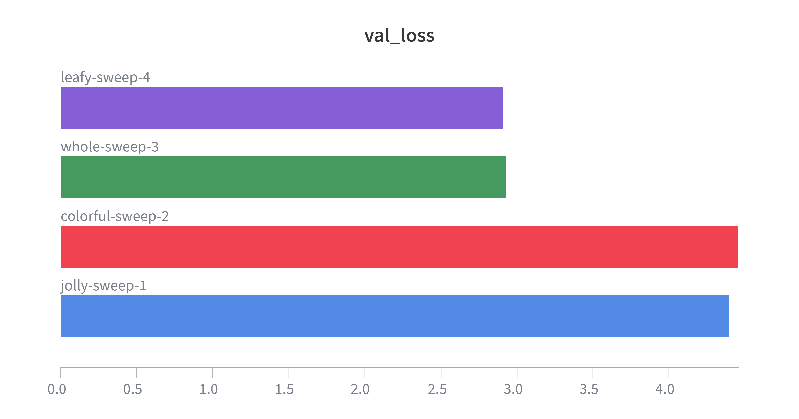
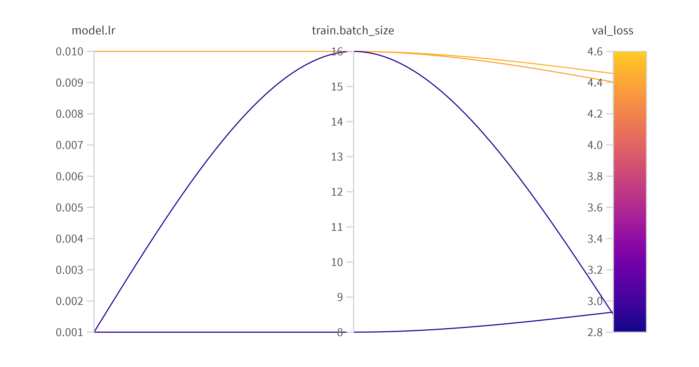

### Question 15

> **Docker is an important tool for creating containerized applications. Explain how you used docker in your**
> **experiments/project? Include how you would run your docker images and include a link to one of your docker files.**
>
> Recommended answer length: 100-200 words.
> Example: For our project we developed several images: one for training, inference and deployment. For example to run the training docker image: docker run trainer:latest lr=1e-3 batch_size=64. Link to docker file:
> Answer:

In our project, we used Docker extensively to ensure a reproducible and consistent execution environment, effectively eliminating dependency conflicts across different machines and operating systems. We containerized our EN→ES translation inference pipeline, packaging everything needed for execution: automatic dependency installation using uv, the complete project source code, model artifacts, and all required configuration files. This containerization approach made our application straightforward to run, test, and deploy within an isolated environment.
To build the Docker image locally from the repository, we used the command: docker build -t en-es-translation:latest -f en_es_translation/Dockerfile en_es_translation. Once built, running the containerized application was equally simple with: docker run -p 8080:8080 en-es-translation:latest. This launches the translation service and exposes it on port 8080, making it accessible for inference requests.
The Dockerfile itself is located at en_es_translation/Dockerfile in our repository. By leveraging Docker, we achieved environment parity between development, testing, and production, significantly reducing the "it works on my machine" problem. The containerized approach also simplified our deployment to cloud platforms and made horizontal scaling much more manageable for our translation service.

### Question 16

> **When running into bugs while trying to run your experiments, how did you perform debugging? Additionally, did you**
> **try to profile your code or do you think it is already perfect?**
>
> Recommended answer length: 100-200 words.
> Example: Debugging method was dependent on group member. Some just used ... and others used ... . We did a single profiling run of our main code at some point that showed ...
> Answer:

The majority of the issues were identified through error messages printed in the terminal when running the data processing and training scripts. We also relied on testing and logging to verify shapes, data flow, and other outputs. This was especially helpful when working with the data pipeline and model inputs. Unit tests also played a role in catching errors at some stages, particularly for the dataset handling and model behavior.

In addition, we occasionally used external tools such as large language models to help reason about errors and unexpected behaviors. LLMs were also helpful when dealing with dependency-related bugs, as none of the team members were fully familiar with that workflow or the underlying functionality.

We do not consider the code to be perfect, and profiling was therefore also explored. We ran a profiling step using PyTorch’s built-in profiler on a single training iteration. The results showed that most of the computation time was spent in core operations such as matrix multiplications, linear layers and dropout, which we expected for transformer-based models. This confirmed that performance issues mainly came from the model architecture itself rather than inefficient code.

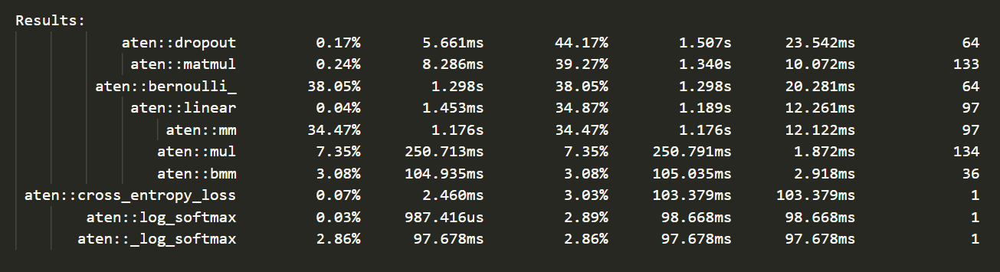

## Working in the cloud

> In the following section we would like to know more about your experience when developing in the cloud.

### Question 17

> **List all the GCP services that you made use of in your project and shortly explain what each service does?**
>
> Recommended answer length: 50-200 words.
>
> Example:
> *We used the following two services: Engine and Bucket. Engine is used for... and Bucket is used for...*
>
> Answer:

In our project, we used the following Google Cloud Platform services: 
The Cloud Storage (Buckets): This service was used as our primary storage solution to hold the dataset, as as to store the versioned model artifacts and outputs from our DVC. 
Compute Engine: This service allowed us to provide high-performance Virtual Machines(VMs) equipped with GPUs, which prvoied the necesary computational power to train our Transformer models. 
Container Registry: We used this to manage and store our Docker container images.
Vertex AI: We leveraged Vertex AI to streamline our machine learning workflow. 

### Question 18

> **The backbone of GCP is the Compute engine. Explained how you made use of this service and what type of VMs**
> **you used?**
>
> Recommended answer length: 100-200 words.
>
> Example:
> *We used the compute engine to run our ... . We used instances with the following hardware: ... and we started the*
> *using a custom container: ...*
>
> Answer:

We utilized Google Cloud Platform's Compute Engine as our primary infrastructure for running training jobs and experiments. Our setup consisted of e2-medium VM instances configured with the following hardware specifications: 2 vCPUs, 4 GB of memory, and 10 GB of disk space. This configuration struck an optimal balance between computational performance and cost-efficiency for our project requirements.
To ensure consistency and reproducibility across different environments, we containerized our training pipeline using a custom Docker image. This container was built directly from the Dockerfile located in our repository's training directory. We automated the entire deployment process by integrating Cloud Build into our workflow. Whenever changes were pushed to the main branch, Cloud Build automatically triggered a new image build and seamlessly uploaded it to GCP's Artifact Registry.
This automation eliminated manual deployment steps and reduced the potential for human error. The containerized approach also provided environment isolation and made it straightforward to scale our experiments or migrate to different VM configurations as needed. The combination of Compute Engine's flexibility and our automated container deployment created an efficient, reproducible training infrastructure.

### Question 19

> **Insert 1-2 images of your GCP bucket, such that we can see what data you have stored in it.**
> **You can take inspiration from [this figure](figures/bucket.png).**
>
> Answer:

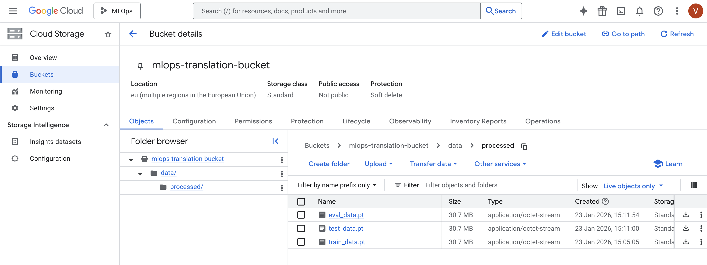

### Question 20

> **Upload 1-2 images of your GCP artifact registry, such that we can see the different docker images that you have**
> **stored. You can take inspiration from [this figure](figures/registry.png).**
>
> Answer:

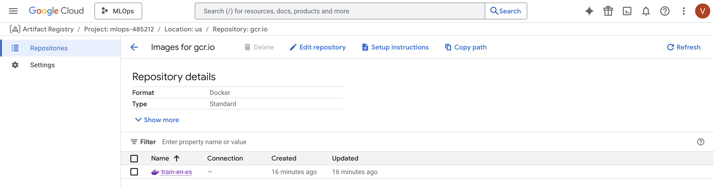
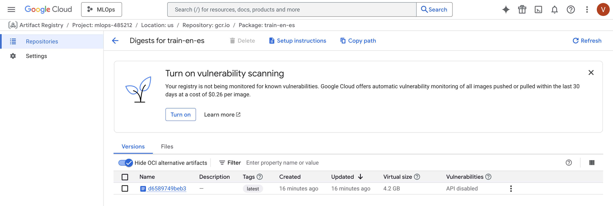

### Question 21

> **Upload 1-2 images of your GCP cloud build history, so we can see the history of the images that have been build in**
> **your project. You can take inspiration from [this figure](figures/build.png).**
>
> Answer:


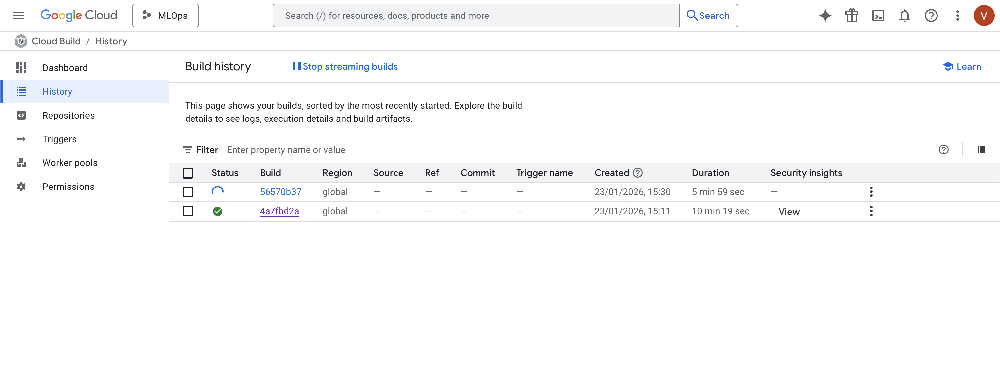
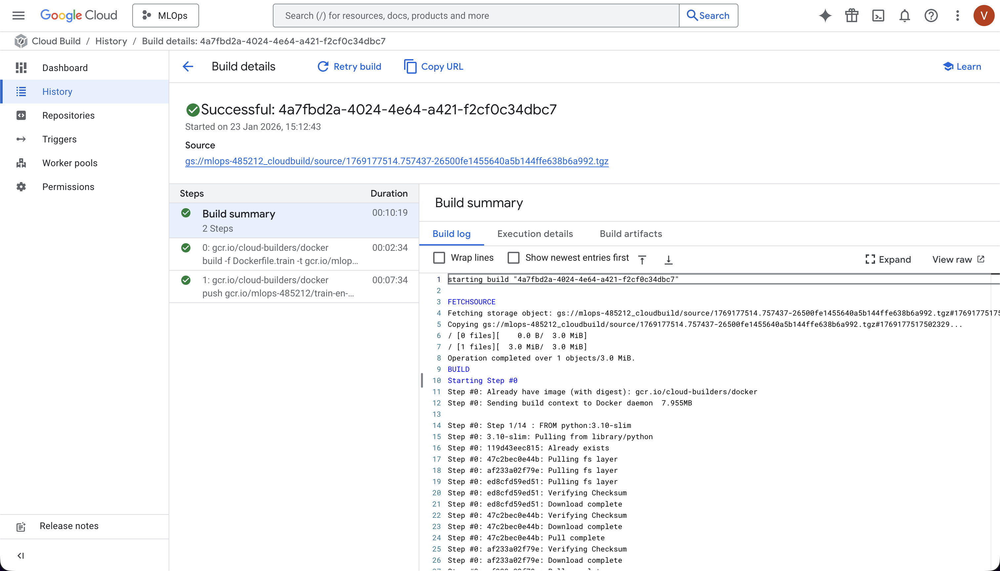

### Question 22

> **Did you manage to train your model in the cloud using either the Engine or Vertex AI? If yes, explain how you did**
> **it. If not, describe why.**
>
> Recommended answer length: 100-200 words.
>
> Example:
> *We managed to train our model in the cloud using the Engine. We did this by ... . The reason we choose the Engine*
> *was because ...*
>
> Answer:

We managed to train our model in the cloud using Compute Engine. We did this by provisioning an e2-medium VM instance and deploying our existing Docker container directly to the instance. Our training workflow involved pushing our Docker image to Google Container Registry, SSH-ing into the Compute Engine instance, pulling the image, and running the container with the necessary volume mounts for data and model checkpoints. We automated this process through our CI/CD pipeline, which triggers training jobs on Compute Engine instances whenever we push updates to our repository.
The reason we chose Compute Engine over Vertex AI was primarily due to easier integration with our existing infrastructure. Our team had already containerized our training pipeline using Docker, and Compute Engine allowed us to use these containers directly without modification. Additionally, Compute Engine integrated more seamlessly with our existing CI/CD pipelines, requiring minimal changes to our automation scripts.

## Deployment

### Question 23

> **Did you manage to write an API for your model? If yes, explain how you did it and if you did anything special. If**
> **not, explain how you would do it.**
>
> Recommended answer length: 100-200 words.
> Example: We did manage to write an API for our model. We used FastAPI to do this. We did this by ... . We also added ... to the API to make it more ...
> Answer:
Yes, we managed to write an API for our model.

We created the API using FastAPI. The API defines a POST endpoint called /translate that receives a JSON request containing a text string. The request format is defined using a Pydantic model, which ensures the input has the correct structure.

The model is loaded once when the API starts using FastAPI’s lifespan function. The loaded model is stored in the application state and reused for all incoming requests. This prevents the model from being loaded again every time the endpoint is called.

When a request is received, the API runs the model in inference mode using torch.no_grad() and returns the translation result. The API is run locally using Uvicorn.

FastAPI’s built-in documentation (/docs) can be used to test the API and send requests to the model.


### Question 24

> **Did you manage to deploy your API, either in locally or cloud? If not, describe why. If yes, describe how and**
> **preferably how you invoke your deployed service?**
>
> Recommended answer length: 100-200 words.
> Example: For deployment we wrapped our model into application using ... . We first tried locally serving the model, which worked. Afterwards we deployed it in the cloud, using ... . To invoke the service an user would call curl -X POST -F "file=@file.json"<weburl>
> Answer:

Yes, we successfully deployed our API locally.

The API was implemented using FastAPI and deployed locally using the Uvicorn ASGI server. The service is started via a Python entry point that launches Uvicorn, making it accessible from the local machine.

The model is loaded at application startup using FastAPI’s lifespan context and stored in the application state. This ensures that the model is initialized only once and reused across incoming requests, which improves efficiency and follows good deployment practices.

The deployed API exposes a POST endpoint at /translate, which accepts a JSON payload containing an input text and returns the translated output.

The service can be invoked using curl, for example:
curl --request POST \
  --url http://localhost:8000/translate \
  --header "content-type: application/json" \
  --data '{"text": "Hello!"}'

Additionally, the API provides interactive documentation via FastAPI’s Swagger UI at http://localhost:8000/docs, which can also be used to test the endpoint.

Cloud deployement:
The API was not deployed to a cloud platform. Local deployment was sufficient for development, testing, and demonstration purposes within the scope of this project, and allowed us to focus on model training, evaluation, and pipeline correctness.


### Question 25

> **Did you perform any unit testing and load testing of your API? If yes, explain how you did it and what results for**
> **the load testing did you get. If not, explain how you would do it.**
>
> Recommended answer length: 100-200 words.
> Example: For functional testing we used pytest with httpx to test our API endpoints and ensure they returned the correct responses. For load testing we used locust with 100 concurrent users. The results of the load testing showed that our API could handle approximately 500 requests per second before the service crashed.
> Answer:
Yes, we performed both unit testing and load testing of our API.

For unit testing, we wrote tests using pytest to verify parts of the project such as data handling and API-related components. These tests were used to check that individual functions and modules behaved as expected and to catch errors early during development. While not all parts of the system were fully covered, the unit tests helped validate core functionality and improve code reliability.

For load testing, we tested the deployed local API by sending multiple requests to the /translate endpoint in a short period of time using a shell script based on curl. In one test, 50 requests were sent sequentially to the API. The total execution time was approximately 8 seconds, resulting. On another test there were 1000 requests sent to the API with the total exuction time approx 156 seconds. This showed that the API was able to handle repeated requests without crashing and with stable response times under light load.

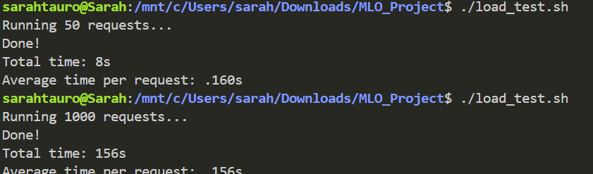


### Question 26

> **Did you manage to implement monitoring of your deployed model? If yes, explain how it works. If not, explain how**
> **monitoring would help the longevity of your application.**
>
> Recommended answer length: 100-200 words.
>
> Example: We did not manage to implement monitoring. We would like to have monitoring implemented such that over time we could measure ... and ... that would inform us about this ... behaviour of our application.
>
> Answer:
No, we did not implement monitoring of the deployed model.

However, monitoring would be important for the longevity of the application. Monitoring helps track whether the API is running correctly and whether the model continues to perform as expected over time. For example, it could be used to detect errors, slow response times, or crashes in the API.

Monitoring could also help identify changes in the input data, such as users sending very different text than what the model was trained on. This could indicate that the model’s performance may degrade over time and that retraining or updates are needed.

In addition, monitoring resource usage such as CPU and memory would help prevent performance issues and ensure the service remains stable as usage increases.


## Overall discussion of project

> In the following section we would like you to think about the general structure of your project.

### Question 27

> **How many credits did you end up using during the project and what service was most expensive? In general what do**
> **you think about working in the cloud?**
>
> Recommended answer length: 100-200 words.
>
> Example:
> *Group member 1 used ..., Group member 2 used ..., in total ... credits was spend during development. The service*
> *costing the most was ... due to ... . Working in the cloud was ...*
>
> Answer:

 Two members used GCP, one of us used $1.15 in credits, while the other one used $5.81, resulting in a total of approximately $6.96 spent during development. The service costing the most was the Virtual Machine in Compute Engine due to the computational resources required for training and running experiments.
Working in the cloud proved to be a valuable experience overall. The pay-as-you-go model allowed us to scale resources dynamically based on our needs, which was particularly useful during intensive training phases. The ability to spin up powerful VMs on demand without investing in local hardware was convenient, though it required careful monitoring to avoid unexpected costs. Cloud services also facilitated collaboration, as team members could access shared resources and results from anywhere.

### Question 28

> **Did you implement anything extra in your project that is not covered by other questions? Maybe you implemented**
> **a frontend for your API, use extra version control features, a drift detection service, a kubernetes cluster etc.**
> **If yes, explain what you did and why.**
>
> Recommended answer length: 0-200 words.
>
> Example:
> *We implemented a frontend for our API. We did this because we wanted to show the user ... . The frontend was*
> *implemented using ...*
>
> Answer:

We implemented a frontend for our API that allows users to interact with the translation service through a graphical interface. The frontend provides a simple way to enter text and receive translated output from the /translate endpoint.

During development and testing, Postman was used for manual testing of the API, while curl was used for automated requests and scripting. The frontend complements these tools by offering an easier and more user-friendly way to interact with the API, especially for demonstration purposes.

This frontend helped us validate the full end-to-end pipeline, from user input in the interface to request handling in the API and model inference. Although it does not directly affect model performance, it improves usability and demonstrates how the API can be integrated into a real application.

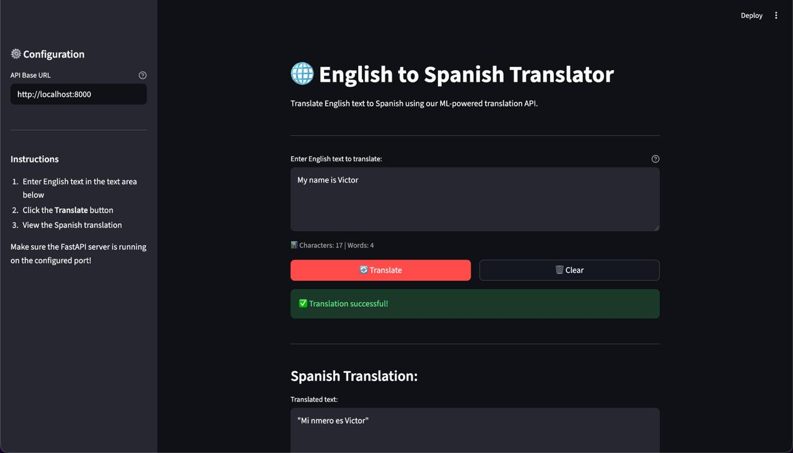


### Question 29

> **Include a figure that describes the overall architecture of your system and what services that you make use of.**
> **You can take inspiration from [this figure](figures/overview.png). Additionally, in your own words, explain the**
> **overall steps in figure.**
>
> Recommended answer length: 200-400 words
> Example: The starting point of the diagram is our local setup, where we integrated ... and ... and ... into our code. Whenever we commit code and push to GitHub, it auto triggers ... and ... . From there the diagram shows ...
> Answer:

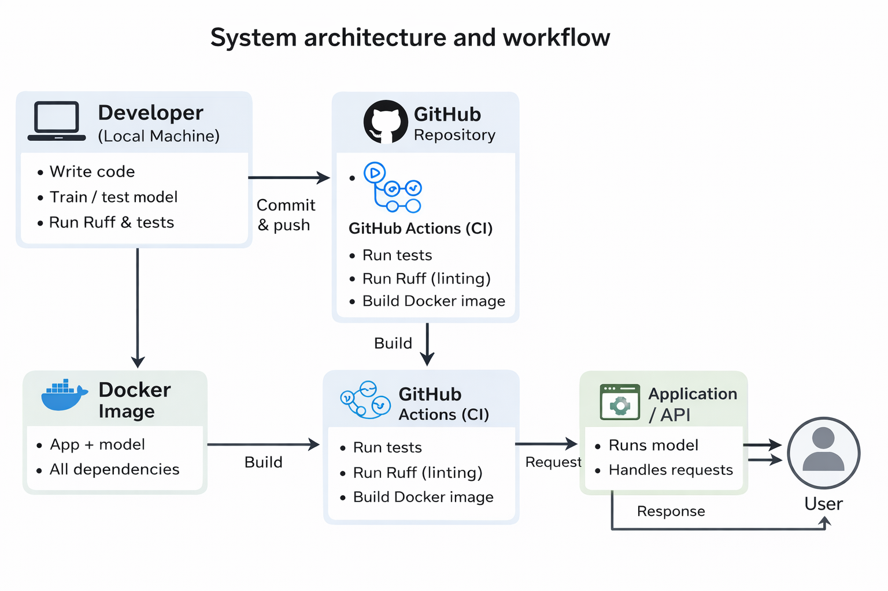

The figure shows the overall architecture of our system and the main steps in the workflow, from development to user interaction. The goal of this architecture is to make sure the  code quality, reproducibility, and a reliable way to run the application.

The process starts on the developer’s local machine, where the code and machine learning components are developed. During development, the developer writes code, tests functionality, and runs automated code quality checks using Ruff. These checks makes sure that the code follows consistent formatting rules and avoids common errors before it is shared with others.

Once the changes are ready, the code is committed and pushed to GitHub, where it is stored in a central repository. Pushing new code automatically triggers a GitHub Actions continuous integration (CI) pipeline. This pipeline runs a series of automated steps, including unit tests and linting with Ruff. These checks make sure that the code is correct, readable, and stable before it is built or used further.

If all CI checks pass, the system builds a Docker image. The Docker image contains the full application, including the model and all required dependencies. Using Docker ensures that the application behaves the same way across different environments and machines.

The Docker image is then used to run the application or API, which handles incoming requests and executes the model logic. Finally, the user interacts with the system by sending requests to the application and receiving responses, such as predictions or results.

This architecture is well suited for larger projects because it separates development, testing, and usage clearly. Automated testing and linting reduce errors, Docker improves reproducibility, and GitHub Actions enables fast feedback. 

### Question 30

> **Discuss the overall struggles of the project. Where did you spend most time and what did you do to overcome these**
> **challenges?**
>
> Recommended answer length: 200-400 words.
>
> Example:
> *The biggest challenges in the project was using ... tool to do ... . The reason for this was ...*
>
> Answer:

Looking back, the most significant struggles in this project weren’t found within the modeling itself, but rather in the complex background that holds a modern ML workflow together. A substantial portion of our development cycle was dedicated to the practicalities of making disparate systems communicate reliably, a process that proved to be a masterclass in navigating real-world technical constraints.

Our first major test was getting used to collaborative version control. While we were all comfortable with basic Git, managing a fast and intense project with multiple contributors required a much higher level of discipline. Initially, frequent merge conflicts and integration issues slowed our momentum. We overcame this not just through better tooling, but creating clearer conventions and steps to follow in order to avoid mistakes, as well as increasing our active communication before pushing major changes. 

The transition to cloud deployment and the DTU HPC cluster provided a different kind of issues. We quickly saw that it was complicated to set up experiments in a shared and high-demand environment. This came with a steep learning curve regarding permissions, job scheduling and reproducibility, since many of us had not used HPC before. Between resource scarcity and the nuances of cluster command structures, we were forced to rethink our workflow. We were expecting to train a big model with a fair amount of hyperparameters, but the limitations we found regarding the HPC access made us train a weaker model.

Finally, while the strictness of our CI pipelines and the integration conflicts between Hydra and Weights & Biases were initially frustrating, they served as essential steps. Aligning our local environments with rigorous automation eventually made things more confortable and handy. By the end of the project, these technical challenges had fundamentally shifted our approach: we moved away from isolated experimentation toward building a robust and collaborative environment.

### Question 31

> **State the individual contributions of each team member. This is required information from DTU, because we need to**
> **make sure all members contributed actively to the project. Additionally, state if/how you have used generative AI**
> **tools in your project.**
>
> Recommended answer length: 50-300 words.
>
> Example:
> *Student sXXXXXX was in charge of developing of setting up the initial cookie cutter project and developing of the*
> *docker containers for training our applications.*
> *Student sXXXXXX was in charge of training our models in the cloud and deploying them afterwards.*
> *All members contributed to code by...*
> *We have used ChatGPT to help debug our code. Additionally, we used GitHub Copilot to help write some of our code.*
> Answer:

s250202 focused on experiment tracking and configuration. This included integrating wandb for logging training metrics and artifacts, setting up  logging, writing configuration files with Hydra, implementing model training code, handling input–output data collection from the deployed application, and dealing with the DTU HPC environment.

s243927 worked primarily on performance optimization and evaluation. Their contributions included adding linting to continuous integration, experimenting with model quantization, compilation, and pruning to improve inference speed, running hyperparameter sweeps, profiling the code to identify bottlenecks, load testing the application, API building, and contributing to model training code.

s250273 was responsible for data versioning and CI robustness. They set up data version control, created and connected a GCP storage bucket, data preprocessing and obtention, 
and extended the CI pipeline with caching and multi-OS/Python/PyTorch testing, as well as adding linting.

s254631 handled deployment and application-level components. This included building the FastAPI inference service, creating a frontend for the API, writing API tests and integrating them into CI, managing configurations with Hydra, adding command-line interfaces, running training on GCP, and implementing data loading and preprocessing.

s250829 focused on project structure and testing. They initialized the repository using a cookiecutter template, implemented Dockerfiles and validated them locally, wrote unit tests for data and model components, computed code coverage, contributed to model training code, and set up the initial CI pipeline.

In addition, all group members regularly met to explain their respective components to one another, ensuring shared understanding of the full project. Everyone also contributed to writing and reviewing the final report. Throughout the project, we used generative AI tools such as ChatGPT and Google Gemini to assist with debugging, brainstorming design decisions, refining ideas, and improving the clarity and structure of both code and written explanations.
